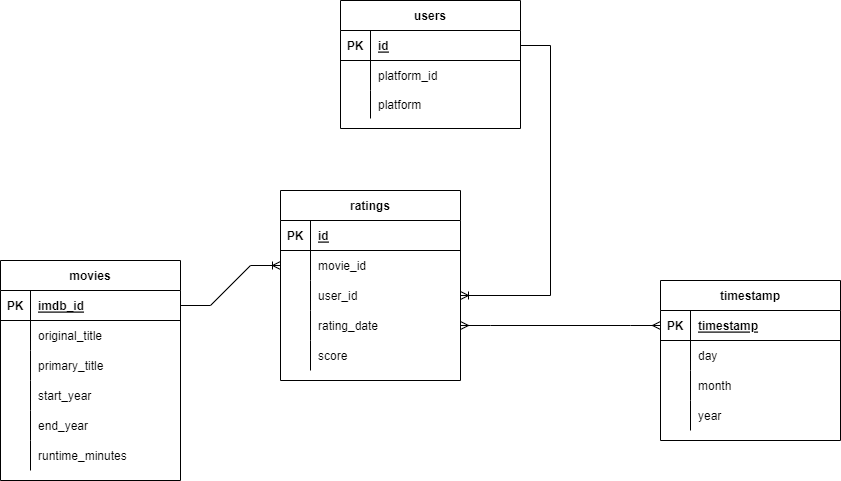
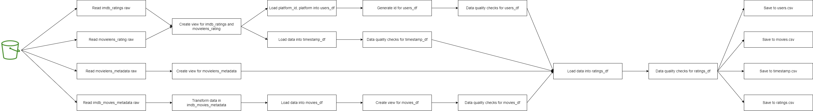

# Project Write Up

## Steps 1: Scope the Project and Gather Data

1. Data using: rating data for movies from multiple sources:
    * MovieLens rating: https://www.kaggle.com/datasets/rounakbanik/the-movies-dataset?select=ratings.csv
    * IMDB rating: https://www.kaggle.com/datasets/ebiswas/imdb-review-dataset
    * IMDB movies metadata: https://www.imdb.com/interfaces/
2. End use-case: analytics table for analyzing the rating for each movie from different platform.
3. Tool chosen:
   * S3 to store data source.
   * PySpark to doing ETL.

## Steps 2: Explore and Assess the Data

Dataset exploration is divided into two files with details explanation.
* ./workaround/movielens_workaround.ipynb: explore movielens dataset.
* ./workaround/imdb_workaround.ipynb: explore 2 imdb datasets.

Below are basic steps when exploring the data in those 2 files:
1. Read the data using pyspark.
2. Print schema to explore the columns.
3. Print the first few rows to have an overview about the data.
4. Choose columns to use in the analysis and drop the rest.
5. Count the number of rows.
6. Check if there are null values for some important columns (like id, timestamp, etc.) and drop rows with null values.
7. Check for duplicate rows for id column, explore if we can keep these duplicate or not.
8. Check for wrong value, like wrong data type, invalid value, etc.

## Steps 3: Define the data model

### Diagram of the data model



`users` table:
* `id`: primary key, id of user, generated automatically when doing ELT.
* `platform_id`: id of that user in the platform that he/she used to rate the movie.
* `platform`: name of the platform that he/she used to rate the movie, like movielens, imdb, etc.

`movies` table:
* `imdb_id`: primary key, id of the movie in IMDB.
* `original_title` and `primary_title`: title of the movie, extracted from IMDB dataset.
* `start_year`: year that release the movie.
* `end_year`: year that the movie ends.
* `runtime_minutes`: length of the movie in minutes.

`timestamp` table:
* `timestamp`: primary key, timestamp of the rating.
* `day`: day of month of the timestamp.
* `month`: month of the timestamp.
* `year`: year of the timestamp.

`ratings` table:
* `id`: primary key, id of the rating, generated automatically when doing ELT.
* `movie_id`: id of the movie, reference to `movies` table.
* `user_id`: id of the user, reference to `users` table.
* `rating_date`: timestamp of the rating, reference to `timestamp` table.
* `score`: rating score of the movie, from 1 to 5.

### ETL pipeline

#### ETL flow diagram



#### Steps description in details from ETL.ipynb

1. Read raw data from S3 using PySpark, and load into:
   1. `imdb_ratings`: ratings data from IMDB rating dataset.
   2. `movielens_ratings`: ratings data from MovieLens rating dataset.
   3. `movielens_metadata`: metadata from Movielens rating dataset.
   4. `imdb_movies_metadata`: metadata from IMDB movies metadata dataset.
2. Load data into `movies_df` table from `imdb_movies_metadata`, transform data like below steps
   1. Select only columns that are defined in data model.
   2. Rename columns to match with data model.
   3. Remove rows with `imdb_id` or `original_title` or `start_year` is null.
   4. Remove duplicate rows for `imdb_id` or combination of `original_title` and `start_year`.
   5. Cast data types for `start_year`, `end_year`, `runtime_minutes` to integer.
   6. Data quality checks for `movies_df`:
      1. `start_year` must larger than or equal to `end_year` if `end_year` is not null.
      2. `runtime_minutes` must larger than 0.
      3. Every `imdb_id` must exist in `imdb_movies_metadata` data source.
   7. Repartition data by `start_year` to improve performance.
3. From `imdb_ratings`, `movielens_ratings`, `movielens_movies_metadata`, create temporary view for them.
4. Load data into `users_df` table:
   1. Union `movielens_ratings` and `imdb_ratings`. Select `userId` (if not null) and `review_id` as `platform_id` and load `platform_id`, `platform` (movielens or imdb) into `users_df`.
   2. Generate `id` for `users_df`.
   3. Data quality checks for `users_df`:
      1. Check if there is any row that has `platform_id` is null.
      2. Check if `platform` is either imdb or movielens.
      3. Check if there is any row that has `id` is null.
      4. Check if every row has valid `platform_id` when joining with data source.
5. Load data into `timestamp_df`:
   1. Union `imdb_ratings`, `movielens_ratings`. Select `timestamp` and `review_date`, use `DATE_FORMAT` and `FROM_UNIXTIME` function to cast them into timestamp and extract to day, month, year and load into timestamp_df.
   2. Repartition `timestamp_df` by year and month to improve performance.
   3. Data quality checks for `timestamp_df`:
      1. Check for null timestamp.
      2. Check for duplicate timestamp.
      3. Check data extraction correctly from timestamp to day, month, year.
6. Load data from `ratings_df`:
   1. Create staging table: `imdb_ratings_split_movies_and_years` by extracting original title and start year from `imdb_ratings` title because `imdb_ratings` does not have `imdb_id` so we have to use `original_title` and `start_year` to search in `movies_df`.
   2. Join `movielens_ratings`, `movielens_metadata`, `movies_df`, `users` and union with the joining of `movies_df`, `imdb_ratings_split_movies_and_years`, `users` and load data into `ratings_df`.
   3. Data quality checks for `ratings_df`:
      1. Use `leftanti` join with other dim tables to check every foreign key is correct.
      2. Check `score` is from 0-5.
      3. Check if `score` has no null value.

## Step 4: Run ETL to Model the Data

### Data dictionary description

```
-- data
   -- imdb_metadata
      -- title.basics.tsv
   -- imdb_ratings
      -- sample.json
   -- movielens
      -- movies_metadata.csv
      -- ratings.csv
```

* title.basics.tsv: data source for movies using imdb data (main data for movies).
* sample.json: ratings data on imdb page.
* movies_metadata.csv: data source for movies using for movielens.
* ratings.csv: ratings data on movielens page.

### Data quality checks

Each destination tables will have a data quality checks after loading data. Data quality checks can be check for null value, check for valid logical like `start_year` must not larger than `end_year`, `runtime_minutes` must not be smaller than 0, etc. Or, data in destination tables must exist in source tables.

## Step 5: Finalize

* What is the goal: analytics table for analyzing the rating for each movie from different platform.
* What queries will you want to run:

1. Top 5 movies that have the highest score
```sparksql
SELECT r.movie_id, m.original_title, m.start_year, AVG(score) AS average_score
FROM ratings r
INNER JOIN movies m
    ON r.movie_id = m.imdb_id
GROUP BY 1, 2, 3
ORDER BY average_score DESC
LIMIT 5
```

2. Top 5 movies that have the highest number of rating users
```sparksql
SELECT r.movie_id, m.original_title, m.start_year, COUNT(*) AS count_ratings
FROM ratings r
INNER JOIN movies m
    ON r.movie_id = m.imdb_id
GROUP BY 1, 2, 3
ORDER BY count_ratings DESC
LIMIT 5
```

3. Top 5 users watch the most number of movies
```sparksql
SELECT u.id, u.platform_id, u.platform, COUNT(*) AS count_watched_movies
FROM users u
INNER JOIN ratings r
    ON u.id = r.user_id
GROUP BY 1, 2, 3
ORDER BY count_watched_movies DESC
LIMIT 5
```
* How would Spark or Airflow be incorporated:
   * Spark: used to do the ETL, extract data from S3, transform and load data into tables.
   * Airflow: ochestrate and schedule the pipeline to run.
* Why did you choose the model you chose: the data model that I choose is simple and easy to build up. Although it is simple, but it represents the needed for analytical tasks.
* Clearly state the rationale for the choice of tools and technologies for the project:
   * S3 to store data source: because the data source is large so it is the best to use a data cloud to store. Furthurmore, using S3 will ensure the security and data reliability.
   * PySpark to doing ETL: because PySpark can split the job into multiple machines to do and it will improve the performance of the overall pipeline.
* Propose how often the data should be updated and why: data should be updated weekly because currently, when a movie is released, people will care about its rating every weeks. They do not care days by days or hours by hours, so it will be the best if the data should be updated weekly.
* If the data was increased by 100x: using the incremental load instead of load every thing each time. We can add the `last_updated` and `last_loaded_time` column into the data source, then each time we run the pipeline, we will only load the data that has `last_updated` >= `last_loaded_time`. By that we will reduce the loading time.
* If the pipelines were run on a daily basis by 7am: we will use the incremental load as above to reduce the loading time, then use Airflow to schedule the pipeline to run on daily basis by 7am.
* If the database needed to be accessed by 100+ people: we will load the destination data into a scalable database like Redshift. It will automatically resize the storage and compute size by the load of the system.